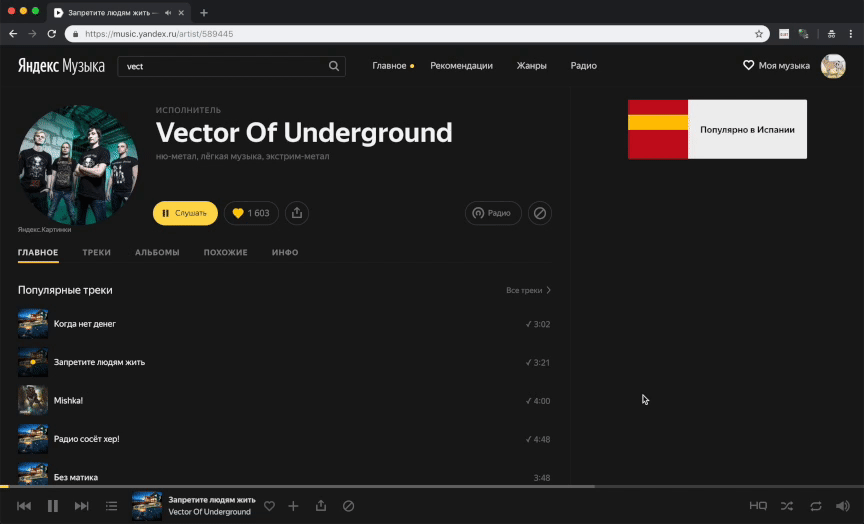

<h1 align="center">
  
   
  Yandex Music Control
</h1>

<h5 align="center">
  Use MacOS media keys to control Yandex.Music in supported browsers.
   
   
  &nbsp;
  &nbsp;
  &nbsp;
  
</h5>

  <a href="#features">Features</a> •
  <a href="#hotkeys">Hotkeys</a> •
  <a href="#configuration">Configuration</a> •
  <a href="#install">Install</a> •
  <a href="#license">License</a>

  

## Features

- Play, pause and skip tracks with native media keys
- Get track info (including album art)
- Like track
- Copy current track link to clipboard

Spoon automatically finds browser that running Yandex.Music. Code contains predefined list of browsers, so if you running YM in multiple browsers at the same time it will select first matched browser.

## Hotkeys

| **Function**                | **Hotkey**                 |
|-----------------------------|----------------------------|
| **Play**                    | Play/Pause track           |
| **Next**                    | Switch to next track       |
| **Prev**                    | Switch to previous track   |
| **&#8984;** &#43; **Play**  | Show current track info    |
| **&#8984;** &#43; **Next**  | Like/Dislike current track |
| **&#8984;** &#43; **Prev**  | Copy link to current track |

## Configuration

`~/.hammerspoon/Spoons/YandexMusicControl.spoon/init.lua`

- **Disable alerts on like and link copy.** Change `SHOW_ALERTS = true` to `false`.
- **Remove browsers from detect list.** Edit `BROWSER_LIST` variable.

## Install

- Install Hammerspoon with `brew cask install hammerspoon`
- Download latest release from [release page](https://github.com/Ty3uK/YandexMusicControl/releases)
- Extract and copy `YandexMusicControl.spoon` into `~/.hammerspoon/Spoons` folder
- Insert `hs.loadSpoon("YandexMusicControl")` into top of `~/.hammerspoon/init.lua` file
- Reload Hammerspoon

## License

MIT
